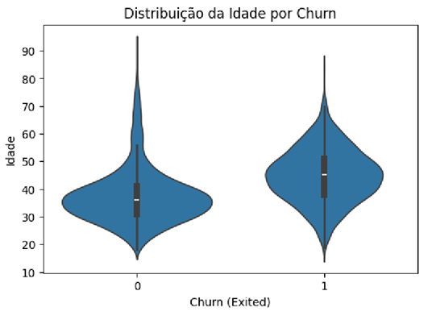
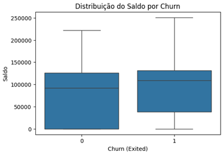
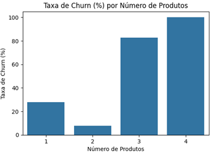

# 🏦 Transformando Churn em R$ 4,17 Milhões de Receita Preservada

## **Visão Geral do Projeto**

Este projeto demonstra como transformar um problema de churn bancário em uma solução de machine learning que **preserva R$ 4,17 milhões anuais** em receita. Através de uma abordagem cíclica de desenvolvimento, criei um sistema de predição que identifica clientes em risco de saída com **59% de F1-Score** e **ROI de 519%**.

### **Problema de Negócio**

- **Taxa de churn atual**: 20% dos clientes saem mensalmente
- **Impacto financeiro**: R$ 16,6 milhões perdidos anualmente
- **Receita média por cliente**: R$ 8.340/ano
- **Base total**: 10.000 clientes

### 🚀 **Solução Implementada**

- **Modelo vencedor**: LightGBM com F1-Score de 59%
- **Receita preservada**: R$ 4,17 milhões/ano
- **Redução de churn**: De 20% para 15% (25% de melhoria)
- **ROI do projeto**: 519% (5,19x o investimento)

---

## 🔄 **Metodologia de Desenvolvimento Cíclico**

### **Ciclo 0: Entendimento do Problema**
- Definição clara do problema de negócio
- Mapeamento do impacto financeiro
- Estabelecimento de métricas de sucesso baseadas em ROI

### **Ciclo 1: Baseline e Primeiros Modelos**
- Análise exploratória inicial
- Implementação de Random Forest e Logistic Regression
- **Primeiro cálculo de ROI**: Random Forest gerou 5.19x de retorno

### **Ciclo 2: Feature Engineering Inteligente**
- Criação de **21 features estratégicas** baseadas em insights de negócio
- Análise bivariada profunda revelando padrões críticos
- Teste de 11 algoritmos diferentes
- Validação cruzada para robustez estatística

### **Ciclo 3: Otimização e Comparação Avançada**
- Refinamento dos modelos
- Análises comparativas sofisticadas
- Visualizações de performance (radar charts, ROC curves)
- Rastreamento completo no MLflow

---

## 🔍 **Análise Exploratória**

### **1. Perfil Etário e Churn** 🎯
- **O que descobri:**: Clientes mais velhos apresentam taxa de churn significativamente maior.



- **Interpretação**: Esta descoberta contrariou totalmente minha hipótese inicial de que clientes mais jovens tenderiam a sair mais. Na verdade, identificamos que clientes de maior idade podem estar menos satisfeitos com serviços digitais, podem buscar bancos mais tradicionais ou podem estar em uma fase da vida com menor necessidade de produtos bancários diversificados.

### **2. Saldo e Comportamento de Saída** 💰
- Clientes com saldos mais altos apresentam **maior churn**

  

- **Interpretação**: São mais visados pela concorrência
- **Ação estratégica**: Programa VIP e atendimento personalizado para high-value customers

### **3. Número de Produtos Contratados - O Insight Mais Crítico** ⚠️



- **Clientes com 1 produto**: 27.71% de churn (representam grande parte da base)

- **Clientes com 2 produtos**: 7.58% de churn (menor taxa de churn!)

- **Clientes com 3+ produtos**: Taxas extremamente altas, mas representam menos de 4% da base.
  
- **Ação estratégica**: Realizar campanhas de cross-sell para clientes com apenas 1 produto, estimulando adoção de um segundo. Revisar a experiência de clientes com 3 ou mais produtos para evitar frustração.


---

## 🧠 **Feature Engineering: 21 Features Estratégicas**

### **Features de Segmentação**
- `age_group`: Faixas etárias para estratégias direcionadas
- `balance_group`: Segmentação por faixa de saldo
- `credit_score_group`: Categorização de risco de crédito

### **Features de Comportamento**
- `is_inactive`: Flag de inatividade (preditor forte)
- `has_multiple_products`: Cross-sell indicator
- `zero_balance`: Contas zeradas (risco alto)

### **Features de Interação**
- `active_x_products`: Engajamento × produtos
- `germany_x_active`: País × atividade
- `balance_salary_ratio`: Relação financeira

### **Features de Valor**
- `high_value_customer`: Saldo alto + múltiplos produtos
- `new_customer`: Clientes novos (≤2 anos)
- `inactive_with_card`: Cartão sem uso (oportunidade)

---

## 💰 **A Matemática do ROI: Metodologia Transparente**

### **Fórmula do Retorno Bruto**
```
Clientes em Risco = Base Total × Taxa de Churn
Churns Detectados = Clientes em Risco × Recall do Modelo  
Clientes Retidos = Churns Detectados × Taxa de Retenção (10%)
Receita Preservada = Clientes Retidos × Receita Anual por Cliente
```

### **Fórmula do ROI Líquido**
```
Custo Total = (Churns Detectados ÷ Precisão) × Custo por Campanha
ROI = (Receita Preservada - Custo Total) ÷ Custo Total
```

### **Parâmetros do Projeto**
- **Base**: 10.000 clientes
- **Taxa de Churn**: 20%
- **Receita por cliente**: R$ 8.340/ano
- **Custo de retenção**: R$ 100/cliente
- **Taxa de retenção**: 10%

---

## 🎯 **Performance dos Modelos: LightGBM como Vencedor**

### **Métricas Técnicas do LightGBM**
- **Precision**: 74% - Evita desperdiçar recursos em falsos positivos
- **Recall**: 50% - Identifica metade de todos os clientes em risco
- **F1-Score**: 59% - Melhor equilíbrio entre precisão e cobertura
- **Accuracy**: 86.39% (±0.42%)

### **Métricas de Negócio**
- **500 clientes retidos por ano**
- **R$ 4,17 milhões em receita preservada anualmente**
- **ROI de 519%**

### **Por que LightGBM?**
- Performance sólida e consistente
- Interpretabilidade para stakeholders
- Velocidade de treinamento e predição
- Robustez em validação cruzada

---

## 📊 **Resultados de Negócio**

### **Impacto Financeiro Anual**
- **Receita Preservada**: R$ 4,17 milhões
- **Investimento**: R$ 117.102
- **Lucro Líquido**: R$ 4,05 milhões
- **ROI**: 519%

### **Impacto Operacional**
- **500 clientes retidos anualmente**
- **Redução de 25% na taxa de churn**
- **Campanhas 74% mais precisas** (menos spam)
- **Otimização do orçamento** de retenção

### **Impacto Estratégico**
- **Insights acionáveis** para produto
- **Segmentação inteligente** de clientes
- **Predição proativa** vs reativa

---

## 🚀 **Recomendações Estratégicas para o Time de Negócio**

### **1. Campanha de Cross-Sell Massiva**
- **Objetivo**: Migrar clientes de 1 para 2 produtos
- **Impacto esperado**: Redução de churn de 27.7% para 7.6%
- **ROI estimado**: 4x melhoria na retenção

### **2. Programa VIP para High-Value Customers**
- **Segmento**: Clientes com saldo alto
- **Ações**: Atendimento exclusivo, taxas diferenciadas, consultoria financeira
- **Objetivo**: Retenção de clientes de maior valor

### **3. Sistema de Reengajamento para Clientes Inativos**
- **Detecção**: Alertas precoces de inatividade
- **Ações**: Campanhas personalizadas, ofertas especiais, contato proativo
- **Métrica**: Redução de 50% no churn de clientes inativos

### **4. Estratégia Regional para Alemanha**
- **Análise**: Investigar concorrência local e preferências culturais
- **Adaptações**: Produtos, comunicação e atendimento localizados
- **Objetivo**: Alinhar com expectativas do mercado alemão

---
